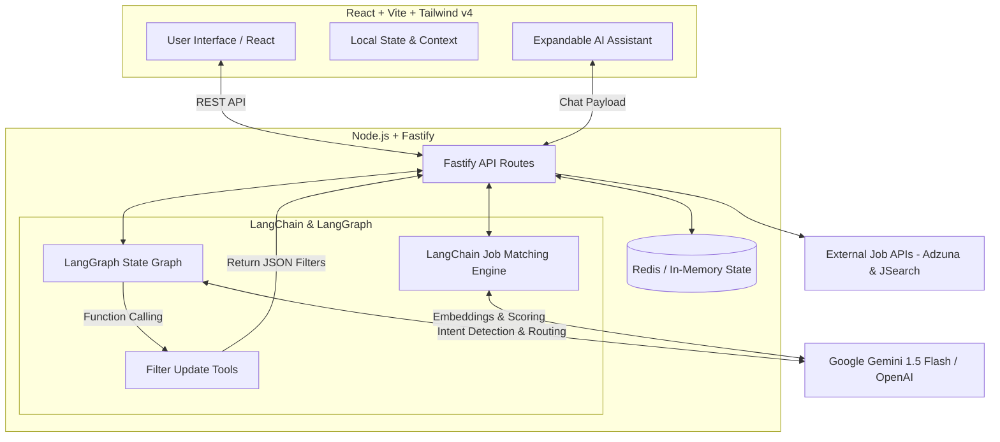

# 🚀 AI-Powered Job Tracker with Smart Matching

A production-ready, full-stack application that leverages **LangChain** and **LangGraph** to intelligently match resumes with real-world job listings and provide a conversational AI assistant capable of controlling the UI.

---

## a) Architecture Diagram



---

## b) Setup Instructions

### Prerequisites
- **Node.js** v18 or higher
- **npm** or **yarn**

### Local Setup Steps

#### 1. Clone the Repository
```bash
git clone <repository-url>
cd smart-job-tracker
```

#### 2. Backend Setup
```bash
cd backend
npm install
cp .env.example .env

# Configure your environment variables in .env:
# GEMINI_API_KEY=your_google_gemini_key
# OPENAI_API_KEY=your_openai_key_optional
# ADZUNA_APP_ID=your_adzuna_id
# ADZUNA_APP_KEY=your_adzuna_key

npm run dev
```

#### 3. Frontend Setup
```bash
cd frontend
npm install
cp .env.example .env

# Configure your frontend variables in .env:
# VITE_API_URL=http://localhost:3001/api

npm run dev
```

#### 4. Test Credentials
To skip onboarding and access the dashboard directly:
- **Email:** `test@gmail.com`
- **Password:** `test@123`

---

## c) LangChain & LangGraph Usage

### How LangChain is used for job matching
LangChain is utilized to interface with the LLM (Gemini/OpenAI) via a structured prompt to evaluate the uploaded resume text against fetched job descriptions. It ensures the AI returns a strict JSON payload containing a 0-100 `score`, a short `explanation`, and an array of `matchedSkills`.

### LangGraph Structure and Nodes
The AI Assistant is built using a **StateGraph** defined in `src/agent.js`. It consists of:
- **`agent` node**: The primary LLM reasoning node.
- **`tools` node**: Handles the execution of tool calls (e.g., updating UI filters).
- **Conditional Edges**: Routes from the `agent` to `tools` if a tool invocation is detected, otherwise routes to `END`.

### Tool/Function Calling for UI Filter Updates
We defined an `update_ui_filters` tool using LangChain's `tool()` wrapper. When the user types *"Show me remote full-time jobs"*, the LLM invokes this tool with arguments like `{ "workMode": "remote", "jobType": "full-time" }`. The graph captures these arguments and passes them back to the React frontend to natively update the UI state.

### Prompt Design
The System Prompt is designed with strict behavior guidelines:
1. **Tool Forcing**: Instructs the AI to *always* use `update_ui_filters` for search-related queries.
2. **FAQ Guardrails**: Embeds specific app knowledge (e.g., how to upload a resume, where to find applications) directly into the system prompt to handle product-help queries without hallucinations.

### State Management Approach
LangGraph maintains a `GraphState` containing:
- `messages`: An appendable array of the conversation history.
- `filters`: A dictionary holding the current filter parameters.
- `actionTaken`: A string flag denoting whether the AI updated a filter (`filter_update`) or just replied to a chat (`chat`).

---

## d) AI Matching Logic

### Scoring Approach
The matching engine uses a weighted heuristic combined with semantic AI evaluation:
- **45% Skill Overlap**: Extracted required skills vs. resume skills.
- **30% Experience Level**: Semantic detection of seniority requirements (Junior, Mid, Senior).
- **25% Title Relevance**: How closely the user's background matches the specific job title.

### Why It Works
By combining keyword extraction with semantic LLM understanding, the system avoids the strict, brittle nature of regex. The AI recognizes that a "Frontend Developer" with "Next.js" experience is a highly relevant match for a "React Engineer" posting, even if exact strings differ.

### Performance Considerations
- **Parallel Batch Scoring**: Jobs are scored simultaneously using `Promise.all` rather than sequentially.
- **Caching**: Fetched jobs from external APIs are temporarily cached in Redis. Scoring operations are only executed when a new resume is uploaded, rather than on every UI re-render.

---

## e) Popup Flow Design (Critical Thinking)

### Why designed this way
Due to browser security policies (CORS and sandboxing), it is impossible to track whether a user *actually* submitted an application on an external website (like LinkedIn or Adzuna). To solve this, the app triggers an `ApplicationPopup` when the user returns to the app tab after clicking "Apply".

### Edge cases handled
- **User clicked apply but got distracted/closed the tab:** Provides a "No, Just Browsing" option to dismiss without polluting their tracker.
- **User realizes they already applied:** Offers an "Applied Earlier" option to log the job without duplicate tracking.

### Alternative approaches considered
- **Webhooks:** Relies on the external job board supporting webhooks, which 99% of third-party boards do not offer to external aggregators.
- **Chrome Extension:** Too much friction. Forcing users to install an extension just to track jobs creates a massive drop-off in user adoption. The "Welcome Back" popup strikes the perfect balance between accurate tracking and minimal user friction.

---

## f) AI Assistant UI Choice

### Why Bubble / Expandable Widget
I chose an **Expandable Floating Assistant (Sticky Assistant)** fixed to the bottom-right corner over a full-page sidebar takeover.

### UX Reasoning
Job hunting is fundamentally a comparative task. Users need to read job descriptions while refining their search. A floating, expandable widget allows the user to issue natural language commands (e.g., *"Show me high match scores"*) and visually see the main job feed update instantly in the background without losing their scroll position or obscuring the primary content area.

---

## g) Scalability

### Handling 100+ Jobs
- **Client-Side Pagination & Memoization:** The frontend uses React's `useMemo` to filter and sort jobs instantly without requiring round-trips to the backend. Pagination (`JOBS_PER_PAGE = 8`) ensures the DOM is never overloaded, keeping rendering fast and memory usage low.

### Handling 10,000 Users
- **Stateless Backend Architecture:** The Node.js/Fastify backend is completely stateless. User session data, resumes, and cached jobs are offloaded to **Redis (Upstash)**. This means the backend can be horizontally scaled infinitely across multiple containers or serverless functions without session collision.

---

## h) Tradeoffs

### Known Limitations
- **External API Formatting:** Job descriptions fetched from external APIs (like Adzuna) often contain messy HTML formatting or lack strict skill arrays, forcing the AI to work harder to extract clean data.
- **In-Memory/Redis Storage:** Currently relying on Redis/JSON for application state. While fast, it lacks the complex relational querying capabilities of a proper SQL database.

### What I'd improve with more time
1. **Permanent Database Integration:** Migrate from Redis to **PostgreSQL via Prisma** for permanent application tracking and complex user analytics.
2. **Background Workers (BullMQ):** Move the heavy AI batch-scoring logic into a background worker queue so the initial job load is instant, and match scores stream in asynchronously via WebSockets.
3. **Authentication:** Implement true OAuth2 (Google/GitHub) instead of the current mocked credentials system.
