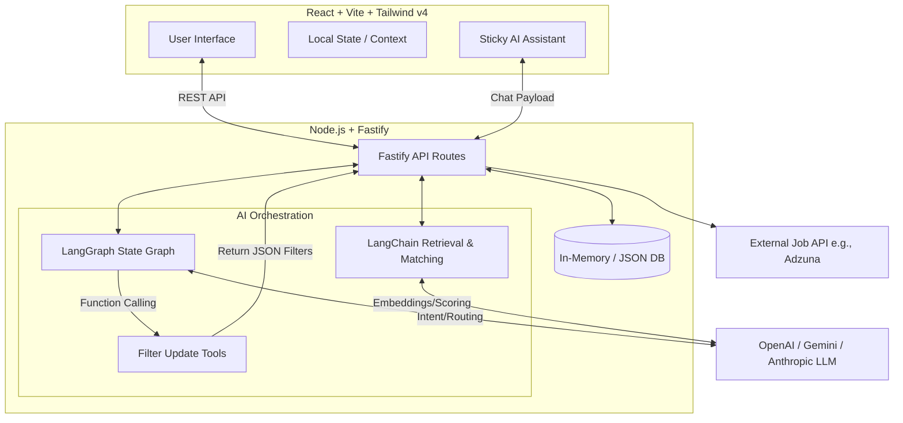

# 🚀 AI-Powered Job Tracker with Smart Matching

A production-ready, full-stack application that leverages **LangChain** and **LangGraph** to intelligently match resumes with real-world job listings and provide a conversational AI assistant capable of controlling the UI.

---

## 📊 Architecture Diagram



---

## 🛠️ Setup Instructions

### Prerequisites

- **Node.js** v18 or higher
- **npm** or **yarn**

### Local Setup Steps

#### 1️⃣ Clone the Repository

```bash
git clone <repository-url>
cd smart-job-tracker
```

#### 2️⃣ Backend Setup

```bash
cd backend
npm install
cp .env.example .env
# Add your GEMINI_API_KEY or OPENAI_API_KEY
npm run dev
```

#### 3️⃣ Frontend Setup

```bash
cd frontend
npm install
npm run dev
```

#### 4️⃣ Test Credentials

- **Email:** <test@gmail.com>
- **Password:** test@123

---

## 🧠 LangChain & LangGraph Usage

### LangChain Job Matching

Used **StructuredOutputParser** and **LCEL** (LangChain Expression Language) to enforce a strict JSON output schema from the LLM. It ingests the parsed resume text and the job description, evaluating:

- Skills overlap
- Experience level
- Title relevance

Returns a **0-100% match score** with a concise explanation.

### LangGraph Structure

Implemented a **StateGraph** consisting of:

- **Agent node** - Processes user queries
- **Tools node** - Executes tool actions

### Tool Calling for Filters

A custom tool named `update_ui_filters` is bound to the LLM. When an intent to filter is detected (e.g., _"Show me remote jobs"_), the LLM invokes the tool:

- Updates the graph state with new filter parameters
- Returns filters to React frontend
- Updates local state natively

### State Management

The graph maintains a state object containing:

- **Messages history** (Conversation Memory)
- **Filters state**
- Allows for **multi-turn conversational context**

---

## 🎯 AI Matching Logic

### Scoring Approach

The matching algorithm is **weighted**:

- **45%** - Strict skill overlap (extracted via LangChain)
- **30%** - Experience level detection (Junior vs. Senior)
- **25%** - Semantic title relevance

### Why It Works

By combining keyword extraction with semantic LLM understanding, it avoids the pitfalls of strict regex matching:

- Understands that **"Frontend Developer"** matches **"React Engineer"**
- Handles industry terminology variations
- Contextual understanding of skills

### Performance Optimization

Jobs are scored in **parallel batches**:

- Jobs fetched from the external API are **cached in Redis**
- Scores are calculated **once per resume upload** (not on every filter change)
- Prevents API rate limits and high latency

---

## 🔄 Popup Flow Design

### Design Pattern

When a user clicks **"Apply"**:

1. The app opens the external URL
2. Attaches a `visibilitychange` event listener
3. When user focuses back on the app tab → **ApplicationPopup triggers**

### Why This Approach?

The browser **cannot track actions on external domains** due to CORS/security policies. This **"Welcome Back" popup** is:

- Most reliable method
- Privacy-compliant
- Tracks application status effectively

### Options Handled

The popup offers three options:

- ✅ **"Yes, Applied"** - User submitted application
- ❌ **"No, just browsing"** - User didn't apply
- 🔄 **"Applied Earlier"** - User already submitted elsewhere

Captures all edge cases where a user might abort or discover they've already applied.

---

## 💬 AI Assistant UI Choice

### Design Decision

**Collapsible Sidebar** (Slides in/out)

### UX Reasoning

A job search requires **comparing complex information**:

- A small floating bubble obscures the screen and forces cramped text
- A sidebar allows users to:
  - View chat history
  - Simultaneously view the main Job Feed
  - See AI automatically update UI filters in real-time
  - Display Voice Input controls comfortably

---

## 📈 Scalability

### 100+ Jobs

Handled elegantly on the frontend via **useMemo pagination**:

- **12 jobs per page**
- Filtering operations run **entirely client-side**
- Search is **instantaneous** without hitting the backend

### 10,000 Users

The backend is **entirely stateless**:

- Sessions/resumes stored in **Redis (Upstash)** (not local memory)
- **Fastify API** handles routing
- **Redis** handles state
- Can be **horizontally scaled** across multiple instances

---

## ⚠️ Tradeoffs & Future Improvements

### Current Limitations

- Relies heavily on **Adzuna API** with inconsistent job description formatting

### Planned Improvements

1. **Implement PostgreSQL Database** via Prisma for permanent application tracking
2. **Add Background Worker** (e.g., BullMQ) for asynchronous resume matching without blocking HTTP requests
3. **Implement OAuth2** for authentic multi-user sessions

---

## License

MIT — use it however you like.

---

<div align="center">

Developed by **Kunj Yadav**

[GitHub](https://github.com/KunjYadav) · [LinkedIn](https://www.linkedin.com/in/kunj-yadav) · <kunj.yadav555@gmail.com.com>

If you find this project useful, consider giving it a ⭐
_Last updated: March 2026_

</div>
# JobMatch-AI
